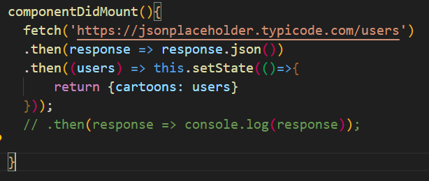
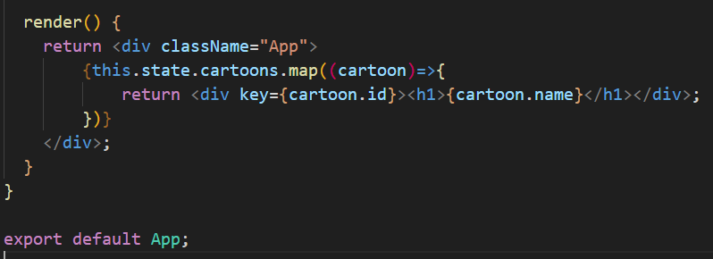
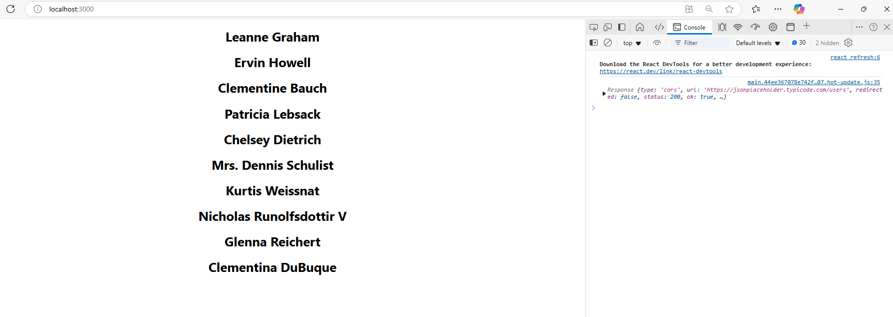

# React practices || Inside App.js
Learning concepts

### Import statements:
-------

import { Component } from 'react';: This imports the Component class from React, which is the base class that allows you to create class components.
import './App.css';: This imports the CSS file named App.css, which likely contains styles for the component.

### Class Definition:
class App extends Component: This defines a React class component named App. It extends (inherits) from the base Component class provided by React.

### Constructor:

constructor(): This is the constructor function of the class, called when the component is initialized. It is used to set up the initial state and to bind methods if necessary.
### Super:
super();: This calls the constructor of the parent class (Component). You must call super() before using this in a class constructor.
this.state: The state object holds the internal data of the component. In this example, state is initialized with an empty array cartoons: [], which suggests that this component will later manage or display a list of cartoons.

------
## [ Fetch | Promise ]

### componentDidMount:

This is a lifecycle method in React class components. It is called automatically after the component is first rendered (mounted) in the DOM. It's commonly used for side effects, such as fetching data from an API.
In this case, you're using componentDidMount to fetch data as soon as the component is mounted.
fetch('https://jsonplaceholder.typicode.com/users'):

This line makes an HTTP GET request to the specified API endpoint (https://jsonplaceholder.typicode.com/users), which returns a list of users in JSON format. The fetch function returns a promise.
.then(response => response.json()):

After the data is fetched, this step processes the response by converting it into a JavaScript object (JSON format). The .json() method also returns a promise.
.then((users) => this.setState(() => { return {cartoons: users} })):

Once the JSON data (list of users) is available, this step sets the component's state by updating the cartoons array with the list of users.
The this.setState() method is used to update the component's state. Here, it takes a function as an argument that returns an object to update the cartoons key with the users data from the API.
Commented Code:

// .then(response => console.log(response)); This is a commented-out line that logs the API response to the console for debugging purposes. If uncommented, it would help you inspect the data returned from the API.

## What's happening in the code:
When the component is rendered for the first time, componentDidMount is called.
Inside componentDidMount, a request is made to the API to fetch a list of users.
When the data is returned, the component's state is updated to store the fetched users inside the cartoons array. As a result, the component will re-render with the new state (which might display this data in the UI).

## Render

The render method maps through the cartoons array in the component's state (which contains users fetched from an API) and creates a list of `
` elements. Each `
` contains the user's name inside an `<h1>` element. This allows the component to dynamically render content based on the fetched data.

## OUTPUT :

